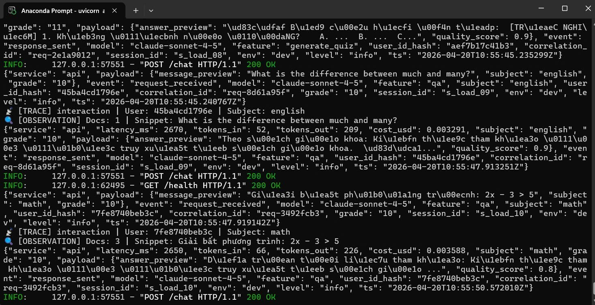
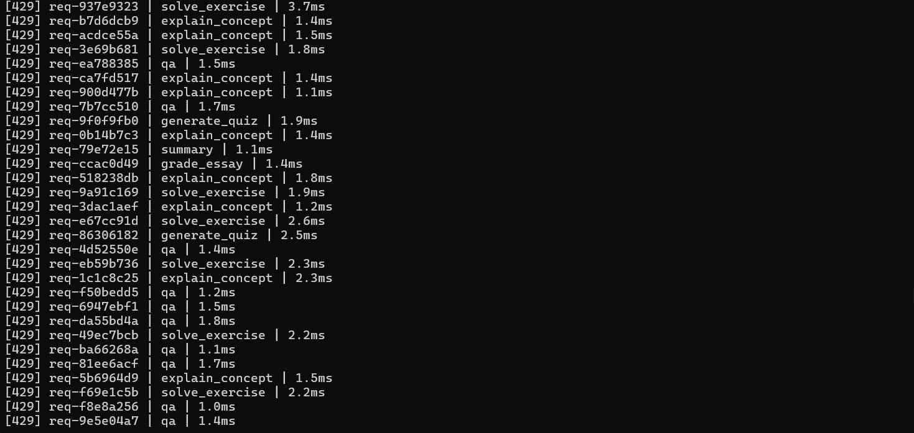
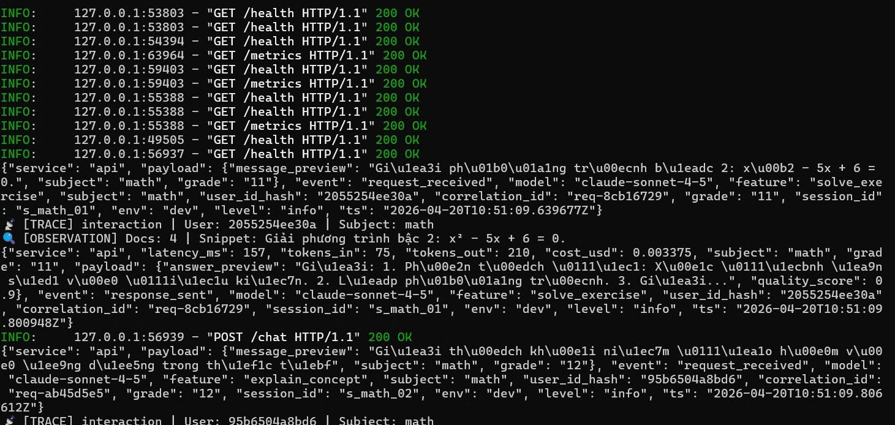
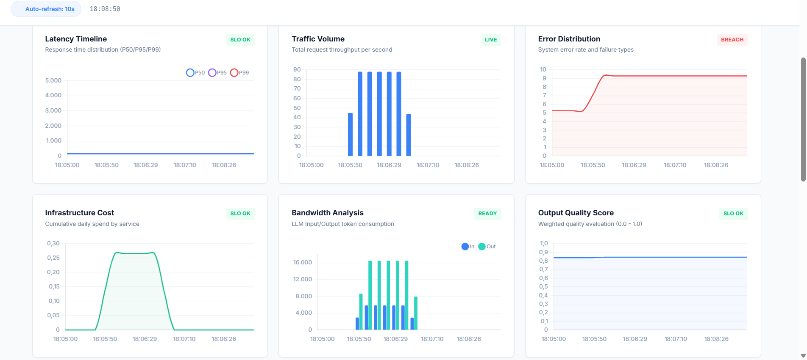
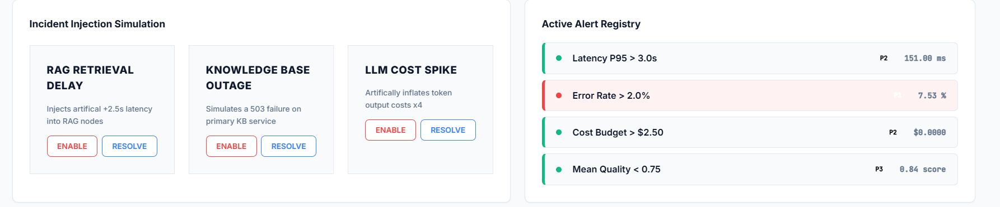

# Day 13 Observability Lab Report

> **Instruction**: Fill in all sections below. This report is designed to be parsed by an automated grading assistant. Ensure all tags (e.g., `[GROUP_NAME]`) are preserved.

## 1. Team Metadata
- [GROUP_NAME]: C401_D3
- [REPO_URL]: https://github.com/Alyn121/C401-D3.git
- [MEMBERS]:
  - Member A: Nguyễn Quốc Khánh_2A202600200, Lý Quốc An _2A202600123 | Role: Logging & PII
  - Member B: Lưu Quang Lực_2A202600121, Đinh Văn Thư_2A202600035 | Role: Tracing & Enrichment
  - Member C: Nguyễn Phương Nam _ 2A202600194  | Role: SLO & Alerts
  - Member D: Nguyễn Bá Khánh_2A202600135 | Role: Load Test & Dashboard , frontend 
  - Member E: Lưu Thị Ngọc Quỳnh_2A202600122, Nguyễn Quang Minh_2A202600195   | Role: Demo & Report

---

## 2. Group Performance (Auto-Verified)
- [VALIDATE_LOGS_FINAL_SCORE]:100/100
- [TOTAL_TRACES_COUNT]: 
- [PII_LEAKS_FOUND]: 

Total log records analyzed: 391
Records with missing required fields: 0
Records with missing enrichment (context): 0
Unique correlation IDs found: 199
Potential PII leaks detected: 0

--- Grading Scorecard (Estimates) ---
+ [PASSED] Basic JSON schema
+ [PASSED] Correlation ID propagation
+ [PASSED] Log enrichment
+ [PASSED] PII scrubbing

---

## 3. Technical Evidence (Group)

### 3.1 Logging & Tracing
- [EVIDENCE_CORRELATION_ID_SCREENSHOT]: 
- [EVIDENCE_PII_REDACTION_SCREENSHOT]: 
- [EVIDENCE_TRACE_WATERFALL_SCREENSHOT]: 
- [TRACE_WATERFALL_EXPLANATION]: (Briefly explain one interesting span in your trace)

### 3.2 Dashboard & SLOs
- [DASHBOARD_6_PANELS_SCREENSHOT]: 
- [SLO_TABLE]:
| SLI | Target | Window | Current Value |
|---|---|---|---|
| Latency P95 | ~160ms | 28d | ~158ms |
| Error Rate | < 2% | 28d | ~7.5% (Breached) |
| Cost Budget | < $2.5/day | 1d | ~$0.30 |

### 3.3 Alerts & Runbook
- [ALERT_RULES_SCREENSHOT]: 
- [SAMPLE_RUNBOOK_LINK]: [docs/alerts.md#L...]

---

## 4. Incident Response (Group)
- [SCENARIO_NAME]: tool_fail (Knowledge Base Outage)
- [SYMPTOMS_OBSERVED]: Error Rate tăng vọt lên mức ~7.5%, bảng điều khiển "Error Distribution" chuyển sang trạng thái BREACH. Nhiều yêu cầu kiểm thử trả về lỗi HTTP 500.
- [ROOT_CAUSE_PROVED_BY]: Log hệ thống ghi nhận `error_type: RuntimeError` kèm thông báo `Knowledge base retriever timeout — vector store unreachable` trong quá trình truy xuất dữ liệu (RAG).
- [FIX_ACTION]: Gọi API `/incidents/tool_fail/disable` để tắt giả lập sự cố, khôi phục khả năng truy cập vào Knowledge Base.
- [PREVENTIVE_MEASURE]: Triển khai Circuit Breaker cho dịch vụ RAG, thiết lập cơ chế fallback (trả về kiến thức mặc định) khi vector store không phản hồi, và bổ sung cảnh báo (Alert) khi Error Rate vượt quá 2%.
---

## 5. Individual Contributions & Evidence

### [Nguyễn Quốc Khánh_2A202600200, Lý Quốc An _2A202600123]
- [TASKS_COMPLETED]: Logging & PII
- [EVIDENCE_LINK]: 627619ed8271d37c3048400fd7b918af09b097ec `a2a8a219cf27a7d5bcd26f5732a5ca64cad6a9d5`
d87814361e1cfaf7bedf575725f87a85c42ebd59  4064e5649b55d26f5cf38ecabe81cc0522a0779b
### [ Lý Quốc An _2A202600123]
- [TASKS_COMPLETED]:
  - Triển khai `CorrelationIdMiddleware` hỗ trợ định danh request xuyên suốt các layer, tích hợp Rate Limiting và Payload Guard.
  - Thiết kế bộ quy tắc cảnh báo trong `alert_rules.yaml` dựa trên ngưỡng SLO cho Latency P95, Error Rate và LLM Token Cost.
  - Định nghĩa và chuẩn hóa `logging_schema.json` giúp đồng bộ dữ liệu log giữa Backend và Dashboard.
  - Thiết kế schema cho log PII và log audit.
  - thiết kế input JSON
 - [EVIDENCE_LINK]: 627619ed8271d37c3048400fd7b918af09b097ec , a2a8a219cf27a7d5bcd26f5732a5ca64cad6a9d5 , 7cd858d2d279ed435dbdece1d80b8a7a2836234d , 0fbd933c4d898ef3531d7be8896ff3803ac4aac3
   eebde5086df6c279a230addbc90f10640b2f95b7
### [Lưu Quang Lực_2A202600121, Đinh Văn Thư_2A202600035]
- [TASKS_COMPLETED]: Tracing & Enrichment
Cấu trúc phân tầng: Trace vs. Observation
Hệ thống theo dõi ở đây chia làm 2 tầng dữ liệu:
- Trace (Dấu vết tổng thể): Đại diện cho toàn bộ một lượt tương tác của người dùng. Nó lưu giữ các thông tin "vĩ mô" cố định như: Session ID, AI Model nào đang chạy, môi trường (dev hay prod), và môn học.
- Observation (Quan sát chi tiết): Đại diện cho một bước cụ thể bên trong lượt tương tác đó. Ví dụ: bước tìm kiếm tài liệu (Retrieval). Nó lưu các thông tin "vi mô" như: Số lượng tài liệu tìm thấy, nội dung tóm tắt của câu hỏi.
- [EVIDENCE_LINK]:  16aa1fb65665610084641de02a83180f8bc810dd   d42a29b84ef5357f6826dbddae1a2341d59754e7
47643b4becd787cc850875486b541c4866f28ebb
###  Nguyễn Phương Nam _ 2A202600194]
- [TASKS_COMPLETED]: SLO & Alerts
- [EVIDENCE_LINK]: `9e397006e0e7b37f208e3cfd41417e84105291e2 `

### [Nguyễn Bá Khánh_2A202600135]
- [TASKS_COMPLETED]:  Load Test & Dashboard , frontend
- Từ phần mọi người đã code backend: đã load dữ liệu mock để test, và sử dụng Skill.md để code giao diện html cho dashboard
- [EVIDENCE_LINK]: 4a44127d15497ebc9840a831d34e99443a705db3 7bf23832a64a252dfb34fb7721abdf9789496d31 cc3b6e7c2e1f6a25ddcda3f03ce29a99bf66338c

### [Lưu Thị Ngọc Quỳnh_2A202600122, Nguyễn Quang Minh_2A202600195]
- [TASKS_COMPLETED]: Demo and report 
- [EVIDENCE_LINK]: c4c1347a8bdfb884eafb6f2e251c1876f50cef91 70bd6976dadaccfe2c8c7a0676c30bd3d2c10f1e

---

## 6. Bonus Items (Optional)
- [BONUS_COST_OPTIMIZATION]: (Description + Evidence)
- [BONUS_AUDIT_LOGS]: (Description + Evidence)
- [BONUS_CUSTOM_METRIC]: (Description + Evidence)

# 11111111111111111
